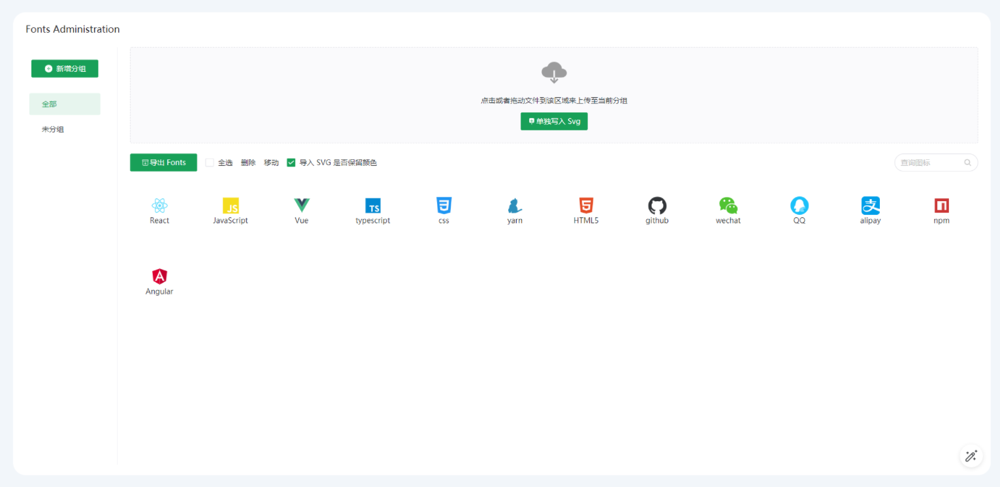

# Vite Fonts Administration Plugin

Manage fonts in Vite projects.

[中文文档](https://github.com/TuiMao233/vite-plugin-fonts-admin/blob/main/README_CN.md)

### Icon Font Created By svgtofont

[svgtofont](https://github.com/jaywcjlove/svgtofont#readme) Svg generate Fonts

[archiver](https://github.com/archiverjs/node-archiver) Files compress Zip

## Vite Plugin Use

~~~typescript
import { defineConfig } from 'vite'
import { ViteFontsAdmin } from 'vite-plugin-fonts-admin'
export default defineConfig({
  plugins: [
    ViteFontsAdmin()
  ]
})
~~~

## Vue Use

~~~html
<!-- src/VFonts/index.vue -->
<template>
  

</template>

~~~

## Visit Fonts Administration

~~~sh
# visit url: Local/fonts
vite v2.3.8 dev server running at:
 > Local: http://localhost:3000/
 > Network: use `--host` to expose
# http://localhost:3000/ >>> http://localhost:3000/fonts
~~~

## Generate dir

~~~sh
# svg > index.json > fonts/...
src
- index.json # option
- fonts # css | ttf | woff | woff2 | svg
~~~

## Option

~~~js
ViteFontsAdmin({
  // Generate font path, default 'src/VFonts'
  dir: 'src/VFonts',
  // Generate font name, default 'iconfont'
  fontName: 'iconfont',
  // Generate css class prefix, default fontName
  classNamePrefix: 'iconfont',
  // Whether to generate css entrance
  css: true,
  // Whether to generate base64 css entrance
  base64: true
})
~~~

## Alone deploy

~~~sh
clone https://github.com/TuiMao233/vite-plugin-fonts-admin.git
# add node_modules
yarn
# run server
npm run serve
~~~

## License

Licensed under the [MIT License](https://opensource.org/licenses/MIT).

